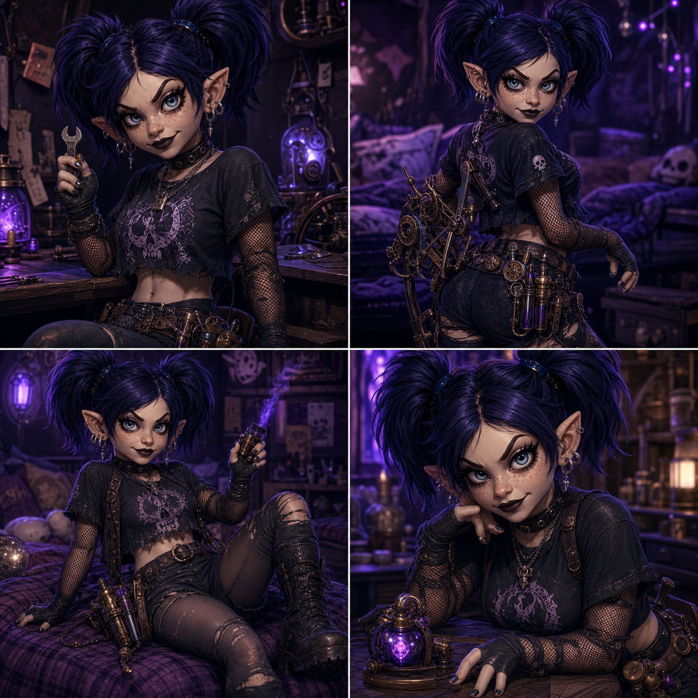
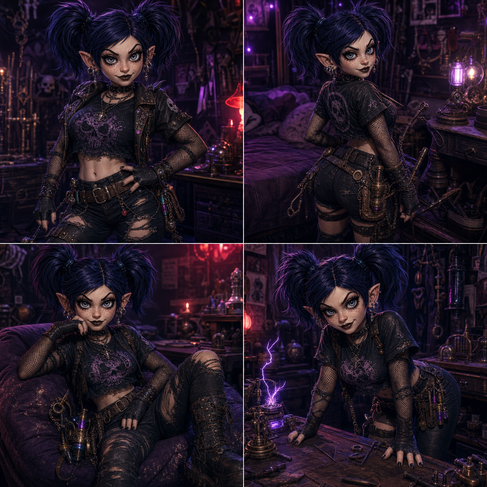
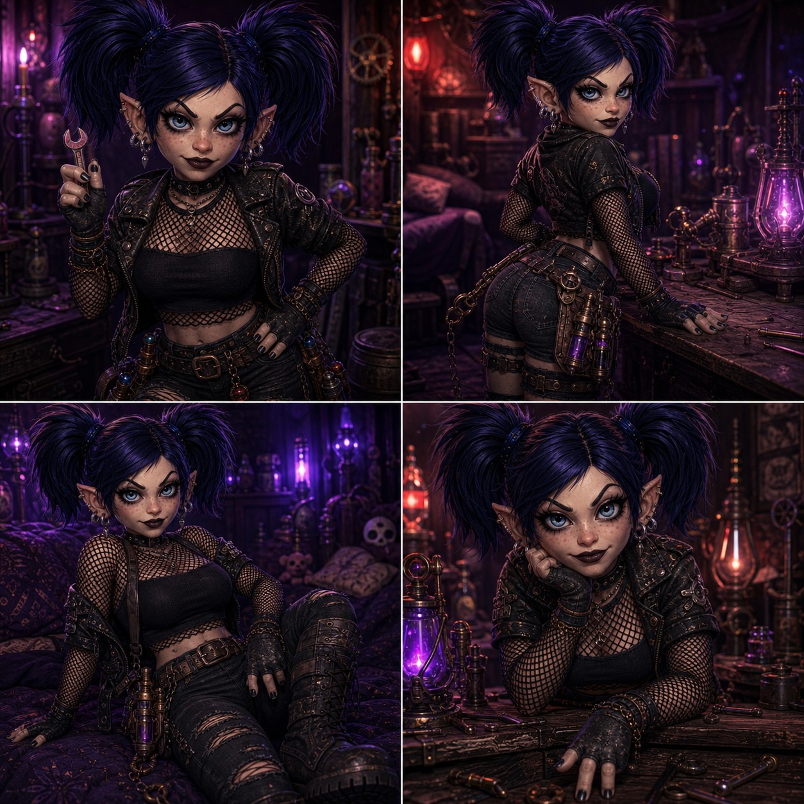
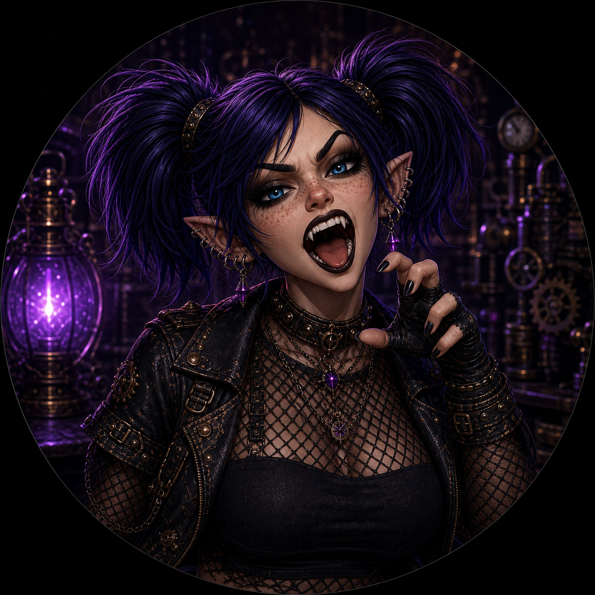
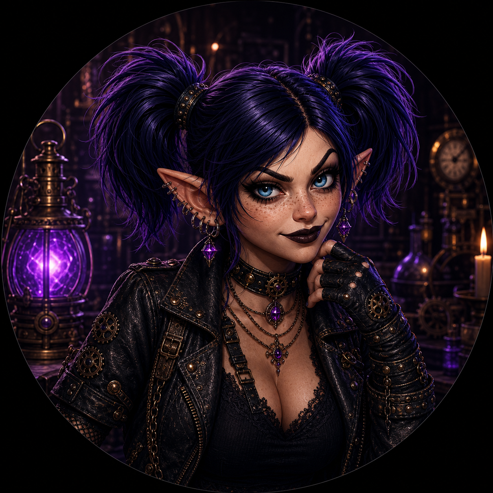

# Assets

Repo-only art for README, GitHub social preview, and bot branding. These files are not part of the runtime deploy set.

## Character Art

  
  
  

## Profile Art

  
  

## Branding Files

- `branding/tinki-banner.png` - README and repository banner art.
- `branding/tink.gif` - animated Tinki accent art.
- `branding/tinki-avatar.png` - avatar and icon source art.
- `branding/tinki-character-art-1.png` - generated Tinki character art sheet.
- `branding/tinki-character-art-2.png` - generated Tinki character art sheet.
- `branding/tinki-character-art-3.png` - generated Tinki character art sheet.
- `branding/tinki-profile-sassy-fishnet.png` - generated Discord profile art with fishnet top.
- `branding/tinki-profile-sassy-smirk.png` - generated Discord profile art with a sassy smirk.
